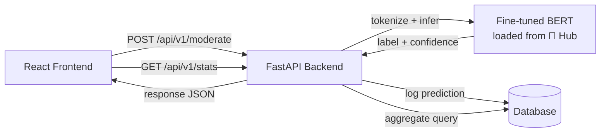

<div align="center">

# AI-Powered Content Moderation System
### Detecting Hate Speech & Trolls in Indian Social Media


A transformer-based classifier that labels social media text as
**Safe**, **Offensive**, or **Hate Speech** — with a confidence score and
a word-level explanation for every prediction — served through a FastAPI
backend and a React dashboard.

[Live Demo](#-live-demo) · [How It Works](#-how-it-works) · [Model](#-the-model) · [Getting Started](#-getting-started) · [Roadmap](#-roadmap)

</div>

---

## The Problem

Social media use in India spans hundreds of millions of users across
English, Hindi, and code-mixed Hinglish. Manual moderation can't keep
pace, and most existing automated tools are trained and tested almost
exclusively on English text — missing abuse expressed in Hindi, Hinglish,
sarcasm, and culturally specific slurs. This project builds a working,
explainable, fully free-tier-deployable moderation system as a step
toward closing that gap.

## Features

- **3-class detection** — `SAFE`, `OFFENSIVE`, `HATE` — with a confidence
  score per class, not just a single label.
- **Explainable, not a black box** — every prediction highlights the
  specific words that drove it (occlusion-based token attribution).
- **Admin dashboard** — total posts analyzed, breakdown by category, a
  trend chart over time, and a recent-activity feed.
- **Batch mode** — upload a CSV, get predictions for every row, download
  the results.
- **Zero-cost stack** — every service used has a free tier that covers
  this project end to end. See [Tech Stack](#-tech-stack).

## Example

> `"he is idiot"` → **OFFENSIVE** (85% confident) — `SAFE 13% · OFFENSIVE 85% · HATE 3%`, with **"idiot"** highlighted as the driving word.

<!-- Replace with your own screenshot:

-->

## The Model

| | |
|---|---|
| Base model | `bert-base-multilingual-cased` (fine-tuned) |
| Fine-tuned weights | [🤗 lohithg8408/content-moderation](https://huggingface.co/lohithg8408/content-moderation) |
| Training data | [Davidson et al. (2017)](https://arxiv.org/abs/1703.04009) hate-speech corpus + [OLID / SemEval-2019 Task 6](https://arxiv.org/abs/1902.09666), merged into a unified 3-class schema |
| Training set size | 30,199 rows (from a cleaned, deduplicated pool of 37,749) |
| Class balance | SAFE 34.2% · OFFENSIVE 59.2% · HATE 6.6% (handled via weighted loss) |
| External validation | Evaluated on OLID's own held-out SemEval test set (860 tweets, never trained on) |
| Accuracy / Macro-F1 | 🔧 *fill in from your evaluation run — see `docs/07_AI_Model.md` §5* |

**Known limitation:** both source datasets are English-only. The current
model is an English baseline; Hindi/Hinglish support is a scoped,
documented next milestone — see [Roadmap](#-roadmap), not an oversight.

Full reasoning behind the label schema, model choice, and training
hyperparameters lives in [`docs/07_AI_Model.md`](docs/07_AI_Model.md).

## How It Works



More diagrams (training pipeline, request sequences) are in
[`docs/06_System_Flow.md`](docs/06_System_Flow.md).

## 🛠️ Tech Stack

| Layer | Choice | Free tier |
|---|---|---|
| Model training | Google Colab (T4 GPU) + Hugging Face Transformers | ✅ |
| Model hosting | Hugging Face Hub | ✅ |
| Backend | FastAPI + SQLAlchemy | ✅ (self-hosted) |
| Database | SQLite (dev) / Supabase Postgres (prod) | ✅ |
| Frontend | React (Vite) + Tailwind CSS + Recharts | ✅ |
| Deployment | Vercel (frontend) + Render (backend) | ✅ |

Full rationale for every choice: [`docs/03_Tech_Stack.md`](docs/03_Tech_Stack.md).

## Project Structure

```
.
├── docs/                    PRD, TRD, tech stack, implementation plan,
│                            design, system flow, AI model docs
├── data/
│   ├── raw/                 original source datasets
│   └── processed/           cleaned train/val/test/external-test splits
├── scripts/
│   └── preprocess_data.py    merges + cleans + splits the data
├── content_moderation_training.ipynb   Colab fine-tuning notebook
├── backend/                 FastAPI service (loads model, serves API, logs to DB)
│   └── app/
│       ├── main.py, model.py, config.py, schemas.py, db.py, models_db.py
│       └── routes/          moderate.py, stats.py
└── frontend/                React app (Analyze / Dashboard / Batch screens)
    └── src/
        ├── api/client.js
        ├── components/
        └── pages/
```

## Getting Started

### Backend

```bash
cd backend
python -m venv venv && source venv/bin/activate   # Windows: venv\Scripts\activate
pip install -r requirements.txt
cp .env.example .env
uvicorn app.main:app --reload
```
Runs at `http://localhost:8000` — interactive API docs at `/docs`.

### Frontend

```bash
cd frontend
npm install
cp .env.example .env
npm run dev
```
Runs at `http://localhost:5173`.

Full setup notes: [`backend/README.md`](backend/README.md) ·
[`frontend/README.md`](frontend/README.md).

## 🔌 API Reference

```
POST /api/v1/moderate          { "text": "..." } → label, confidence, explanation
POST /api/v1/moderate/batch     multipart CSV upload (column: "text")
GET  /api/v1/stats?range=7d      aggregate counts + timeline + recent activity
```

Full request/response contract: [`docs/02_TRD.md`](docs/02_TRD.md) §5.


## Limitations

- English-only baseline (see above).
- The `HATE` class is a documented approximation from merging two
  differently-annotated source datasets, not a fresh human annotation —
  see [`docs/07_AI_Model.md`](docs/07_AI_Model.md) §1.3 for the exact
  mapping and its caveats.
- This system **flags** content for human review; it does not
  auto-delete or auto-ban anything.

## Citations

```bibtex
@inproceedings{davidson2017automated,
  title={Automated Hate Speech Detection and the Problem of Offensive Language},
  author={Davidson, Thomas and Warmsley, Dana and Macy, Michael and Weber, Ingmar},
  booktitle={ICWSM},
  year={2017}
}

@inproceedings{zampieri2019predicting,
  title={Predicting the Type and Target of Offensive Posts in Social Media},
  author={Zampieri, Marcos and Malmasi, Shervin and Nakov, Preslav and Rosenthal, Sara and Farra, Noura and Kumar, Ritesh},
  booktitle={Proceedings of NAACL},
  year={2019}
}
```


## Credits

Dataset credit to Davidson et al. (2017) and the OLID/OffensEval team (Zampieri et al., 2019).

## Author 

As always Lohith G
