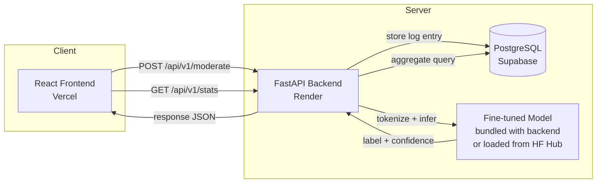
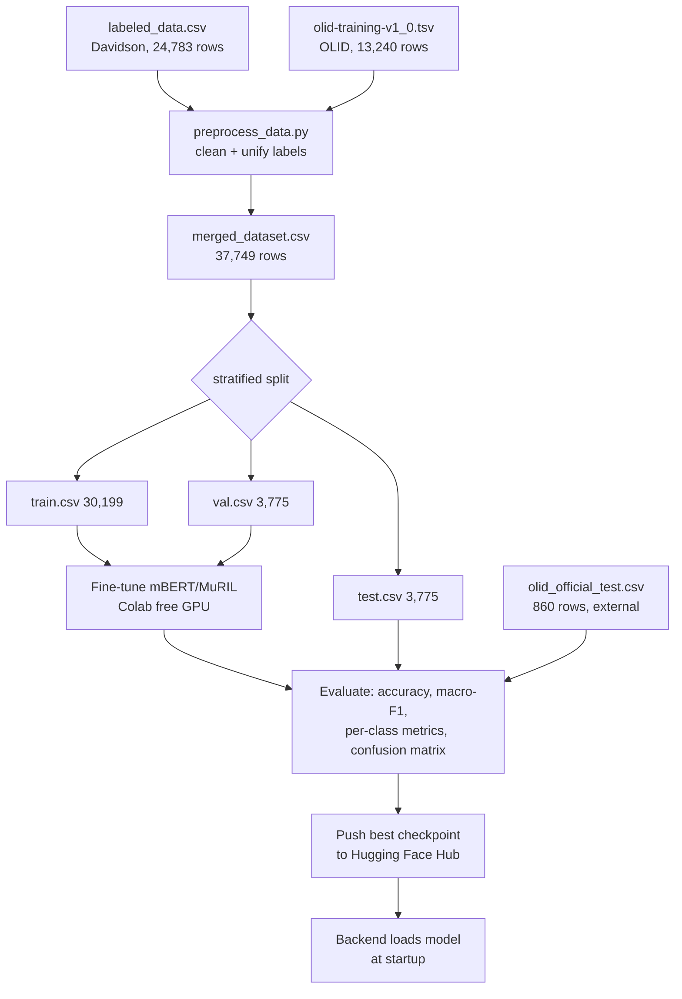
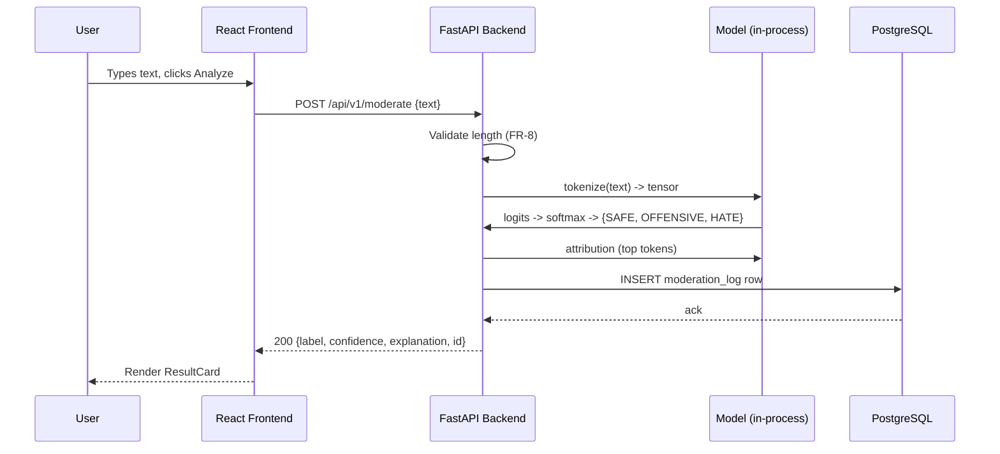
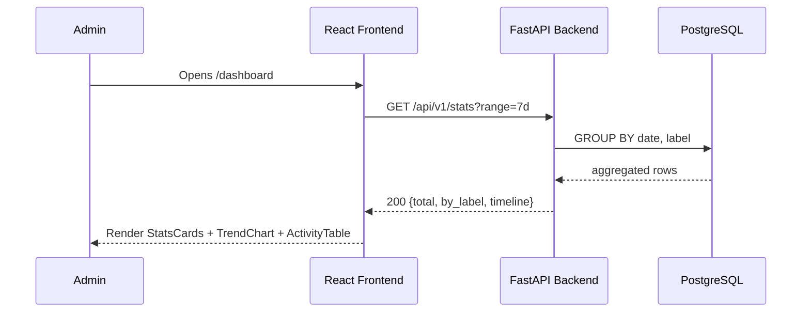

# System Flow
## Architecture, Data Flow & Sequence Diagrams

(Diagrams below are Mermaid — they render automatically on GitHub. If your
report/PDF tool doesn't support Mermaid, paste the code into
https://mermaid.live to export a PNG.)

## 1. High-level architecture

## 2. Model training pipeline (offline, Google Colab)

## 3. Request sequence — single text moderation

## 4. Request sequence — dashboard load

## 5. Data flow summary (plain-English version, for your report)

1. Two public datasets are merged and relabeled into one 3-class schema
   offline, once (`scripts/preprocess_data.py`).
2. A transformer model is fine-tuned on that merged data in Colab, once
   per milestone, and the resulting weights are pushed to Hugging Face Hub.
3. At runtime, the FastAPI backend loads those weights **once** at
   startup (not per-request — this is the single biggest latency lever
   on a free-tier CPU box).
4. Every user request is: validate → tokenize → infer → explain → log to
   Postgres → respond. Nothing here calls back out to Colab or
   re-trains — training and serving are fully decoupled, which is what
   makes the free-tier hosting realistic in the first place.
5. The dashboard reads aggregated rows straight out of Postgres; no
   separate analytics pipeline is needed at this scale.
